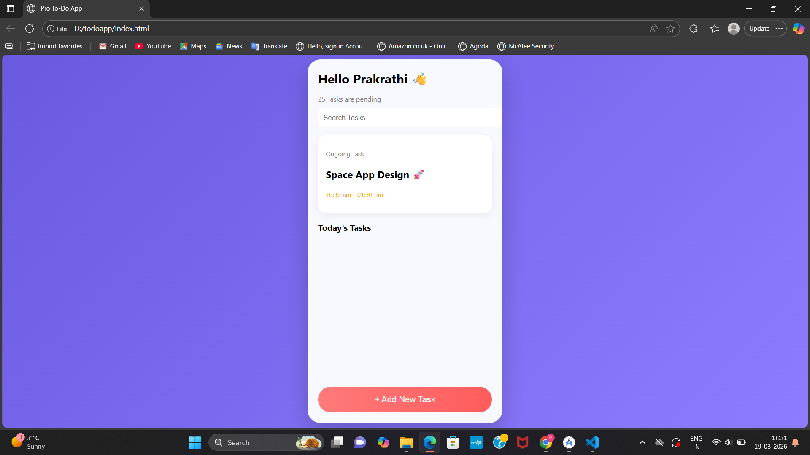

# 📝 Modern To-Do List App

A modern and attractive To-Do List web application built using HTML, CSS, and JavaScript. This project helps users manage daily tasks efficiently with a clean and user-friendly interface.

---

## 🚀 Features

- ➕ Add new tasks
- ✅ Mark tasks as completed
- ❌ Delete tasks
- 🎨 Modern UI with gradient design
- 📱 Mobile app-like interface
- 🔍 Search bar (UI)
- 🧾 Task sections (Ongoing + Today's tasks)

---

## 🛠️ Technologies Used

- HTML5
- CSS3
- JavaScript

---

## 📸 Screenshots

---

## ▶️ How to Run

1. Download or clone this repository  
2. Open the project folder  
3. Double-click `index.html`  
4. Run in browser  

---

## 📌 Project Purpose

This project was developed as part of an internship task for Android App Development, demonstrating UI design and task management functionality.

---

## 🙌 Author

- Prakrathi K Shetty
